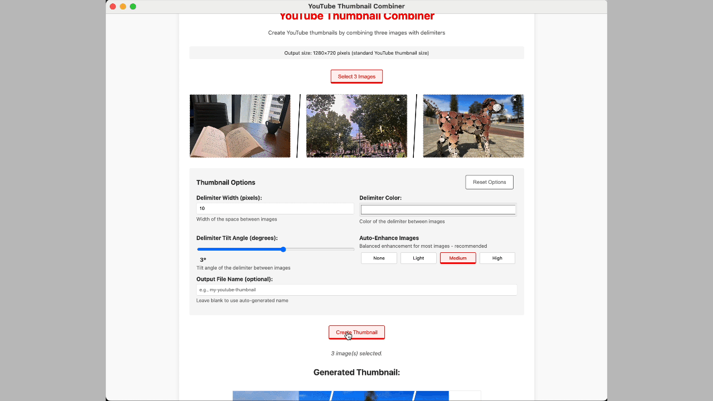
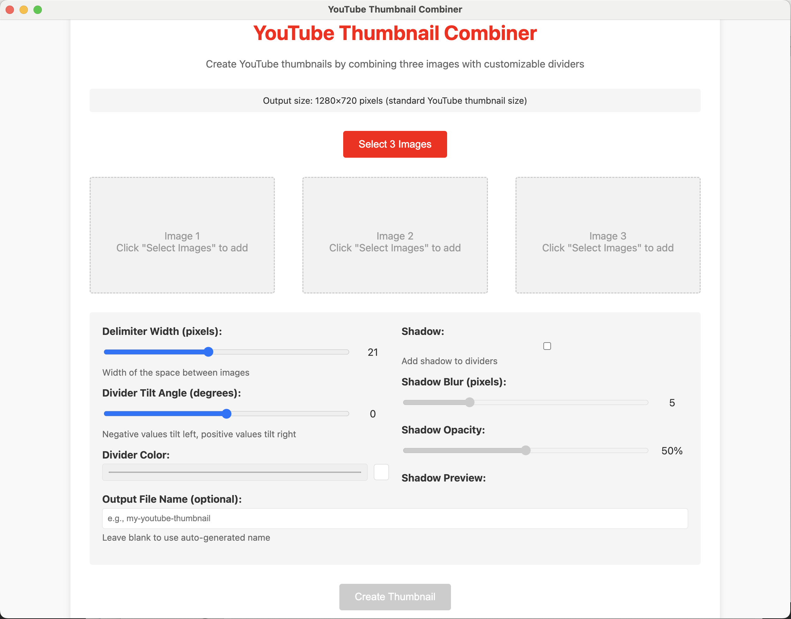
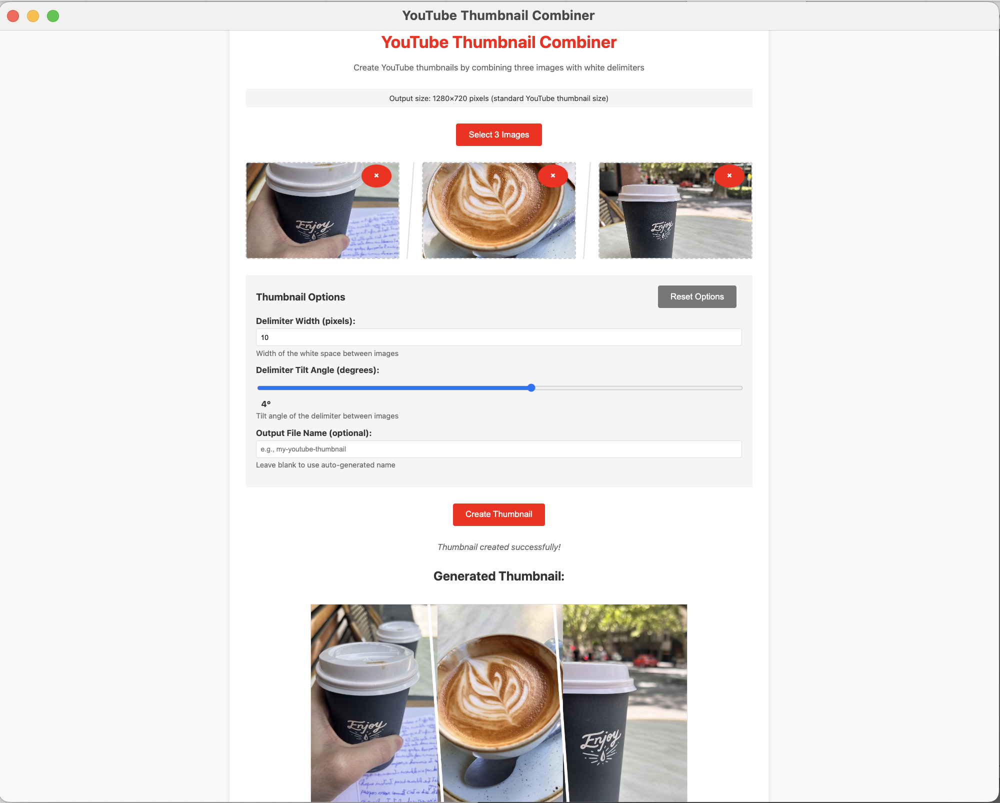

# YouTube Multi Image Thumbnail Creator 📸🎨

Create simple but truly efficient **Universal YouTube Thumbnails**, by horizontally placing three images with white delimiters 🎨

This app is ideal for any of your next multi-language YouTube vlogs, tutorials, cooking, traveling, "Day in the Life" (DITL) videos, and more! With just a few clicks, you can generate professional-looking thumbnails that help boost engagement on your channel.



- [⚙️ Requirement](#%EF%B8%8F-requirement)
- [📦 Installation](#-installation)
- [🪄 Features](#-features)
- [🚀 App Store Publication](#-app-store-publication)
- [👨‍🍳 Who is the baker?](#-who-baked-this)
- [🎥 Me building this app](#-me-building-this-app)
- [⚖️ License](#%EF%B8%8F-license)

## ⚙️ Requirement
* [Node.js](https://nodejs.org/) - latest LTS version recommended 🚀
* [Electron](https://www.electronjs.org/) - for cross-platform desktop app support

## 📦 Installation
The simplest way to add this application to your system:

```console
git clone https://github.com/pH-7/youtube-thumbnail-creator.git
cd youtube-thumbnail-creator
npm install # install dependencies
npm start # start the Electron app
```

## 🪄 Features
### Select Three Images
```
Choose any three images from your computer to combine into a professional YouTube thumbnail.
Images will be automatically resized to fit the standard YouTube thumbnail dimensions (1280×720 pixels).
```

### Customize Delimiters
```
Adjust delimiter width, color, and tilt angle to create unique separators between your images.
Add optional shadows with customizable blur and opacity for a professional touch.
```

### Easy Export
```
Save your thumbnails directly to a dedicated folder in your Pictures directory.
Give custom names to your thumbnails or use auto-generated filenames with timestamps.
```

### Preview in Real-Time
```
See exactly how your thumbnail will look before exporting.
Make adjustments with immediate visual feedback.
```

### Multi-Image Combination
- Combine 2 or 3 images horizontally with clean white delimiters.
- Perfect for creating YouTube thumbnails that showcase multiple scenes or perspectives.

### Automatic Layout Detection
- Smart mode analyzes your images to determine the optimal number of splits.
- Manual mode lets you choose between 2 or 3 image layouts.

### Image Enhancement
- Auto-enhance your images with optimized settings for YouTube thumbnails.
- Choose from None, Light, Medium, or Strong enhancement levels.

### YouTube Optimization
- NEW! Optimize thumbnails specifically for YouTube with WebP format
- Reduces file size by 25-35% while maintaining high quality
- Perfect for faster uploads and better viewer experience

### Customization Options
- Adjust delimiter width and color.
- Apply tilt angles to delimiters for a dynamic look.
- Control enhancement levels to make your thumbnails pop.

## 🚀 App Store Publication

This app is designed to be published on the Mac App Store. Follow these instructions for submission:

### Prerequisites

Before starting the build process, you need:

1. An active Apple Developer account
2. App Store Connect setup for your app
3. A provisioning profile for Mac App Store distribution
4. App Store Distribution certificate

### Environment Setup

Set these environment variables before running the build script:

```bash
# Required environment variables for signing and notarization
export APPLE_ID=your_apple_id@example.com
export APPLE_ID_PASSWORD=your_app_specific_password
export APPLE_TEAM_ID=your_team_id
```

> **Note**: For the `APPLE_ID_PASSWORD`, use an app-specific password generated from your Apple ID account page rather than your main account password.

### Provisioning Profile

Place your provisioning profile at this location:
```
/Users/pierre-henrysoria/Code/Thumbnail-Creator/build/embedded.provisionprofile
```

### Build Commands

```bash
# Build for development testing (Mac App Store build)
npm run mas-dev

# Build for App Store submission (doesn't auto-publish)
npm run mas-package

# Build and publish to App Store Connect
npm run mas
```

### Common Issues & Solutions

1. **Signing Issues**: Ensure your certificates are valid and installed in your keychain
2. **Entitlements Errors**: Check that the entitlements files match your provisioning profile capabilities
3. **Notarization Failures**: Verify your Apple ID and app-specific password are correct
4. **Sharp Module Issues**: If image processing fails, try rebuilding the sharp module with:
   ```bash
   npm run rebuild-sharp
   ```

### Developer Tools

- Use `electron-builder --config` to see the full configuration options
- Check the project's `.gitignore` to ensure sensitive files (like the provisioning profile) aren't committed

## 🧑‍🍳 Who baked this?
[](https://PH7.me 'Pierre-Henry Soria personal website')

**Pierre-Henry Soria**. A super passionate and enthusiastic software engineer! 🚀 True cheese 🧀 , coffee, and chocolate lover! 😋 Reach me at [PH7.me](https://PH7.me) 💫

☕️ Are you enjoying it? **[Offer me a coffee](https://ko-fi.com/phenry)** (my favorite coffee to start the day is almond flat white 😋)

[![@phenrysay][twitter-icon]](https://x.com/phenrysay) [![YouTube Tech Videos][youtube-icon]](https://www.youtube.com/@pH7Programming "My YouTube Tech Channel") [![pH-7][github-icon]](https://github.com/pH-7)

## 🎥 Me building this app
Check out my YouTube channel where I explain the process of building this app from scratch using Electron and Node.js: [YouTube Channel](https://www.youtube.com/@pH7Programming/videos).







## ⚖️ License

This YouTube Thumbnail Creator is licensed under the MIT License.

[twitter-icon]: https://img.shields.io/badge/Twitter-1DA1F2?style=for-the-badge&logo=twitter&logoColor=white
[youtube-icon]: https://img.shields.io/badge/YouTube-FF0000?style=for-the-badge&logo=youtube&logoColor=white
[github-icon]: https://img.shields.io/badge/GitHub-100000?style=for-the-badge&logo=github&logoColor=white
